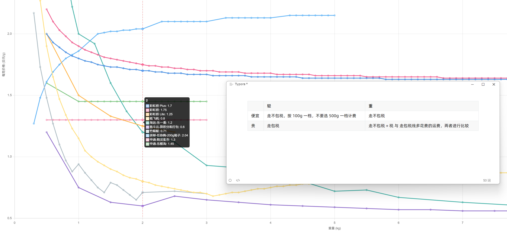
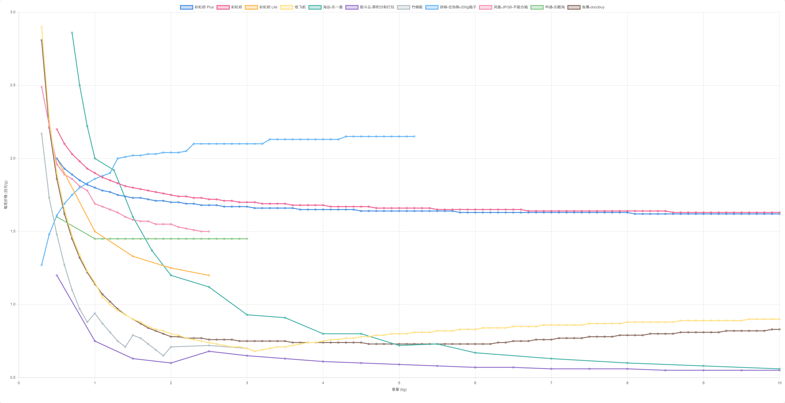
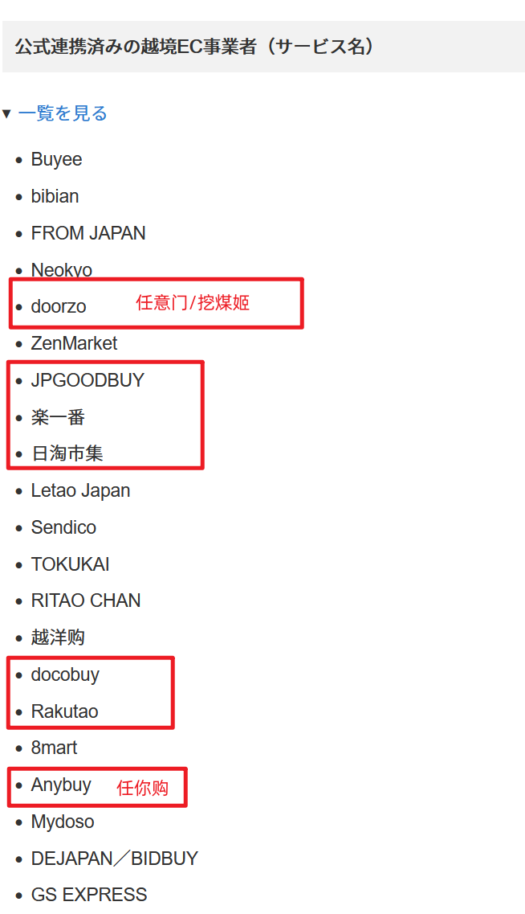

[运费图表网页版](https://2-3-5-7.github.io/jp-cn-shipping-chart)

线路可分为两类，包税线和不包税线，这个维度就要基于货值来选线路，包税线的价格更贵

- 多数 0.2 税率就是货值小于 250 (50 / 0.2)，纸片类是 0.13 小于 380，混合就要具体计算
- 包税：彩虹桥XX、竹蜻蜓 plus、拼邮-任你购、申通-乐酷淘、鱼鹰-docobuy
- 不包税：纸飞机、竹蜻蜓、筋斗云、邮政线路（ems、海运、空运）

另一个维度是重量（有的有体积重），重量越大每克运费越便宜，所以可以多买点然后 🐟 卖掉抵扣运费，重量低运费就不划算，当然拼邮稍微好些

两个维度就可以形成 4 种情况
- 很少量，物品不算箱子净重 300g 以下，任你购拼邮
- 便宜且轻，竹蜻蜓，物品类别不能走的话，纸飞机、筋斗云
- 贵且轻，乐一番商品打折后走包税线。第二考虑，docobuy、乐酷淘，这些很少打折，但运费便宜的线
- 便宜且重
对于书籍光盘走乐一番纸飞机，还可以捎带些便宜且轻的周边。其它类别，考虑筋斗云（可能有异形件费用）
3-5 kg 之间的书籍光盘，如果货物便宜，也可以考虑筋斗云（书籍线额外加收商品价值 5%）
5 kg 以上物品海运，非书籍筋斗云也可以
- 贵且重，走不包税 + 税 与 走包税线多花费的运费，两者进行比较选择

- 运费不是全部。乐一番商品打折，签到积分，就相当于节省运费了，尤其对于贵的东西，打九折，就可以抵扣多收取的运费

线路注意

- 乐一番，纸飞机箱子费用至少 100 日元，彩虹桥plus（顺丰）有体积重
- 日淘市集，加固费 200 日元，但同时 500 积分抵扣很容易做到（去🐟买）。
500g 一档，重量低可能跳档不划算。
手续费、合单费用、异形件费用，筋斗云没有书籍光盘免税额，而书籍光盘线额外加收商品价值 5% 费用。
- 挖煤姬，手续费，竹蜻蜓物品有类别限制
- 任你购，手续费，拼邮有物品类别限制。拼邮国际段不算箱子重，为了与其它线路比较，假设了 200g 箱子
- 乐酷淘，箱子费用至少 100 日元
- docobuy，最便宜的包税线，鱼鹰，2 万日元以内，商品小于 15 个，cd 不能和其它物品混发，这条线比较慢
- jpgoodbuy，老平台，运费没看到优势。凤凰线只能一单，不能合箱。除乐一番以外的，即支持转运又支持代购的平台，但是邮政线也不让发 r 本
- 精灵集市，新平台，政策很不稳定（一个月改好几次），客服体验差，各种营销，也运营转运“池袋顺丰”。客观说，申通运费比乐酷淘便宜，但我不推荐

图 3 是煤炉合作平台列表，我个人感觉越靠前平台的运营时间越长，更可靠

